<div align="center">


# DeskMakeover

<a href="README.zh-CN.md"></a>

**Give your Windows desktop a look you actually like. Don't like it? One click puts everything back.**

[](#-how-to-install)
[](#-how-to-install)
[](LICENSE)
[](https://v2.tauri.app/)

**English** · [中文](README.zh-CN.md)

<br/>

<a href="#-how-to-install">
  
</a>

DeskMakeover turns a cluttered Windows desktop into something calm and deliberate.<br/>Preview first, apply when you're happy. Change your mind? One click brings it all back.

</div>

## ↩️ You can always go back

Want to tidy your desktop but scared of breaking it? That "can't get it back" fear is the first thing we solved:

- **It backs everything up first**, like taking a photo of your desktop: icons, arrows, wallpaper, kept exactly
- **One-click restore**, back to just how it was
- **Runs only on your computer**: no account, no upload, nothing online
- **Nothing technical to touch**: pick, preview, click. That's the whole job

<div align="center"><br/><br/><br/></div>

## ✨ Nine looks built in

Each one hand-tuned on a real desktop. Pick one, click once, every icon puts it on. The same folder, nine ways:

<div align="center">

<br/>
<sub>Squircle · Blueprint · Pixel Era · Gleam · Glaze · Die-Cut · Porthole · Scrapbook · Creekstone</sub>
</div>

<br/>

<table align="center">
<tr>
  <td align="center">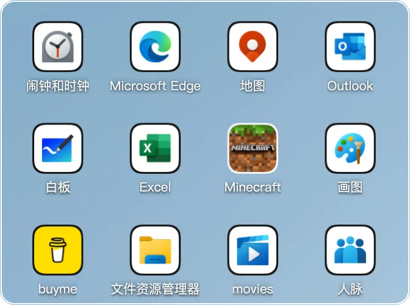<br/><b>Squircle</b><br/><sub>continuous corners</sub></td>
  <td align="center">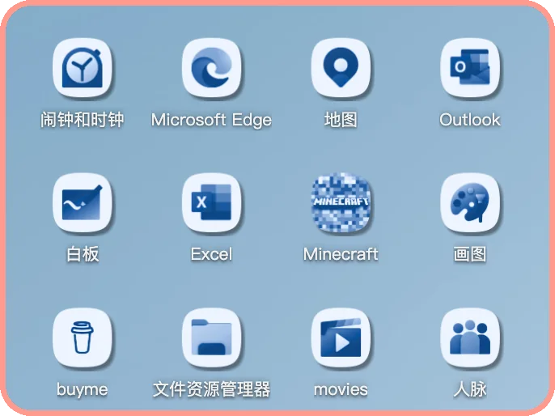<br/><b>Blueprint</b><br/><sub>monochrome ink</sub></td>
  <td align="center">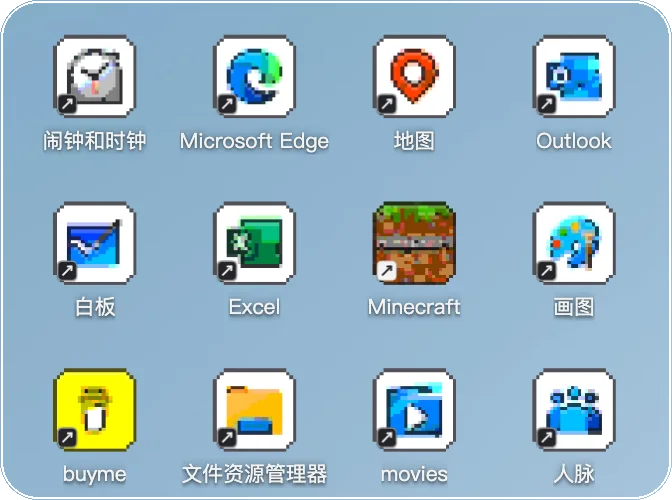<br/><b>Pixel Era</b><br/><sub>8-bit afternoon</sub></td>
</tr>
<tr>
  <td align="center">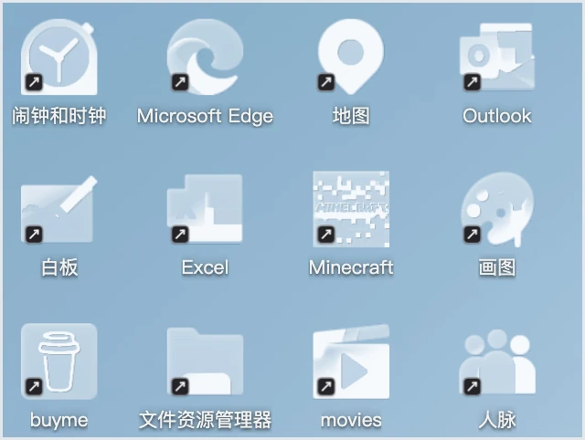<br/><b>Gleam</b><br/><sub>brushed with light</sub></td>
  <td align="center">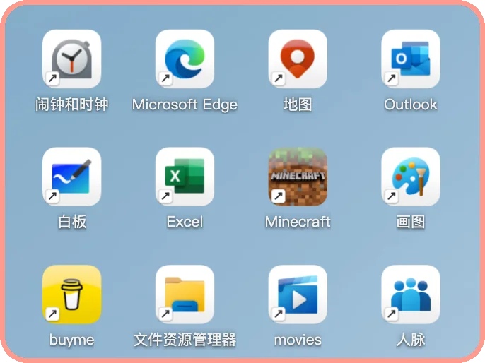<br/><b>Glaze</b><br/><sub>cool porcelain</sub></td>
  <td align="center">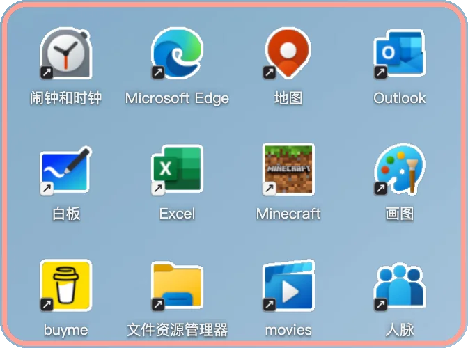<br/><b>Die-Cut</b><br/><sub>sticker outlines</sub></td>
</tr>
<tr>
  <td align="center">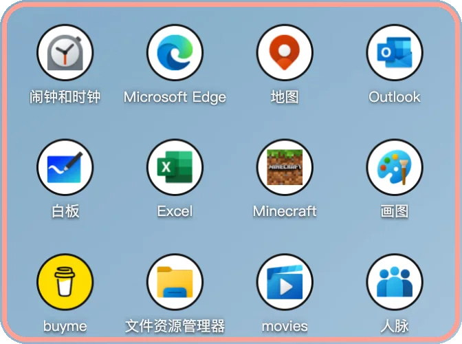<br/><b>Porthole</b><br/><sub>clean circles</sub></td>
  <td align="center">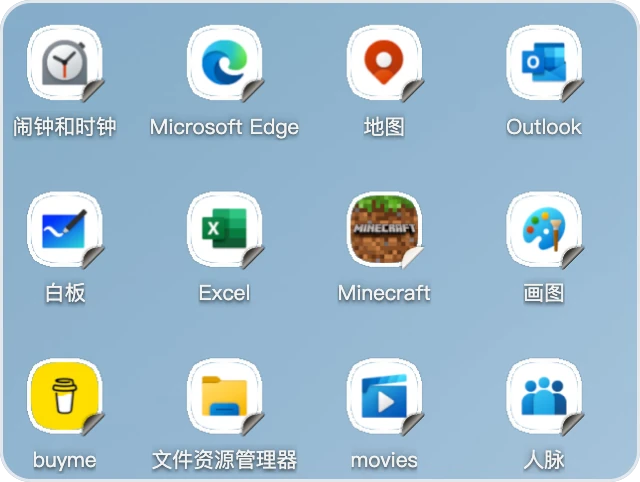<br/><b>Scrapbook</b><br/><sub>pasted by hand</sub></td>
  <td align="center">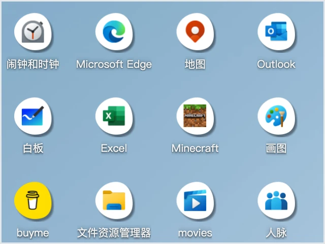<br/><b>Creekstone</b><br/><sub>river-worn stone</sub></td>
</tr>
</table>

## 🎨 Make every part yours

The nine are a starting point. Eleven icon shapes, plus coloring, plates, finishes, and shortcut marks, each adjustable on its own. Thousands of combinations:

- Apps, folders, and plain files can each wear their own look
- Hold to compare with the original, right-click to restyle a single icon, undo and redo freely

<div align="center">
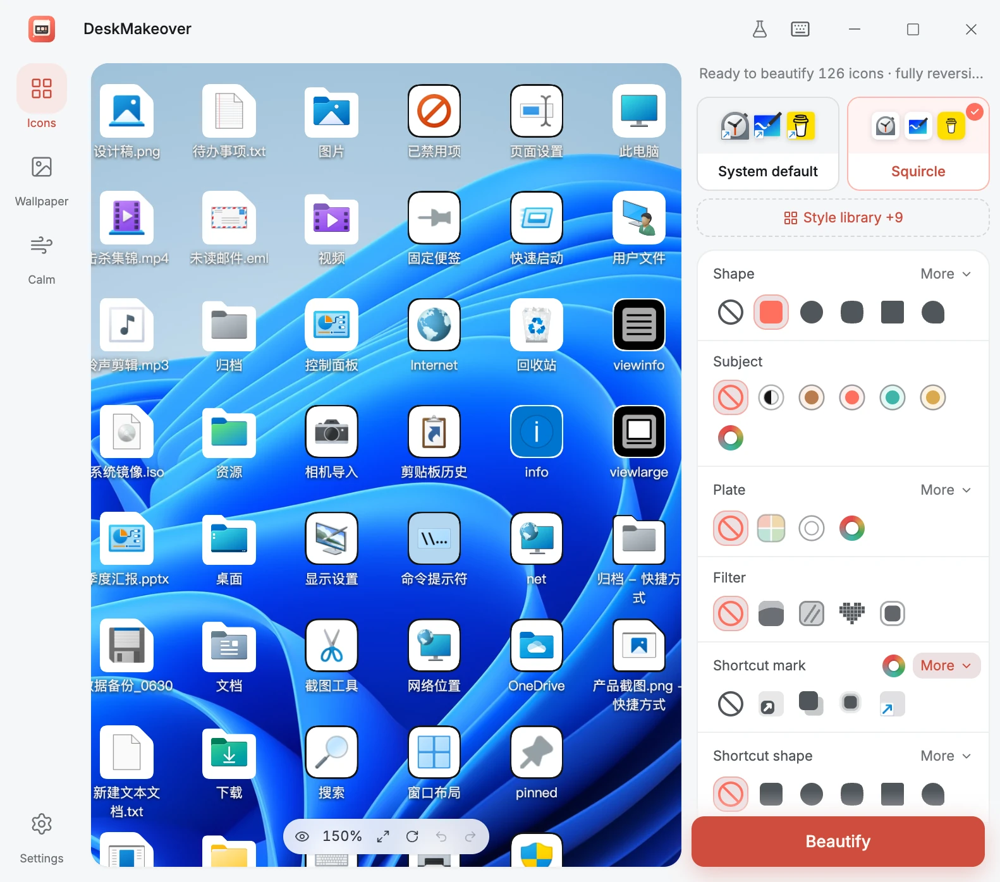
<br/>
<sub>The live preview zoomed in on the left; every axis adjustable on the right.</sub>
</div>

## 🧩 Save it. Share it.

Landed on a combination you love? Save it as your own style and reuse it with a click. Export it as a file for a friend, or import style packs other people made.

<div align="center">
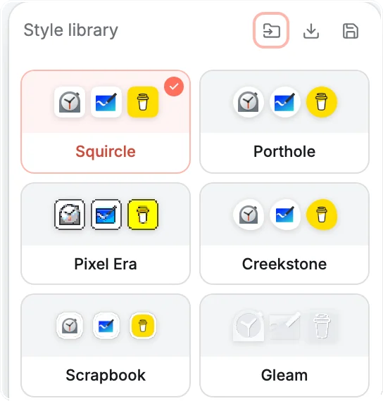
<br/>
<sub>Your library lives next to the built-ins: save, export, import.</sub>
</div>

## 🗂️ Draw zones on your wallpaper

Icons piling into one big crowd? Draw translucent zones onto the wallpaper, one for work, one for fun. Drag them anywhere, size them however, five materials and four title styles, or lay down a ready-made layout template in one click. Your wallpaper is backed up; removing zones is one click.

<div align="center">
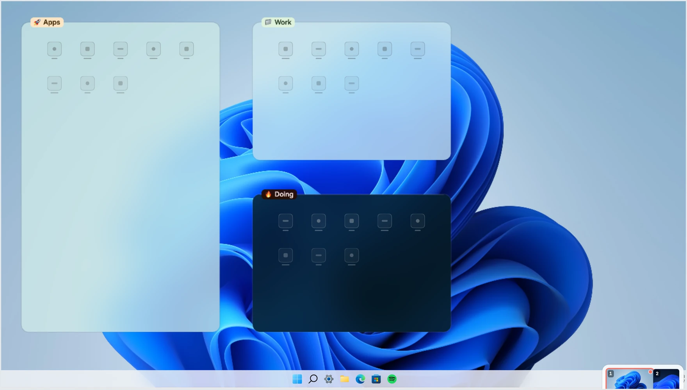
<br/>
<sub>One click of a layout template put these three zones down.</sub>
</div>

## ✂️ The little shortcut arrow: swap it or remove it

Find that arrow ugly? Swap it for a cleaner mark, or remove it. The app does it for you; Windows asks once for permission and you click allow. Backed up first, one click brings it back.

> There's also a built-in Calm helper that quiets some of Windows' noisier defaults. It asks before every change, and every change can be turned back.

<div align="center"><br/><br/><br/></div>

## 🎛️ Inside the studio

<div align="center">
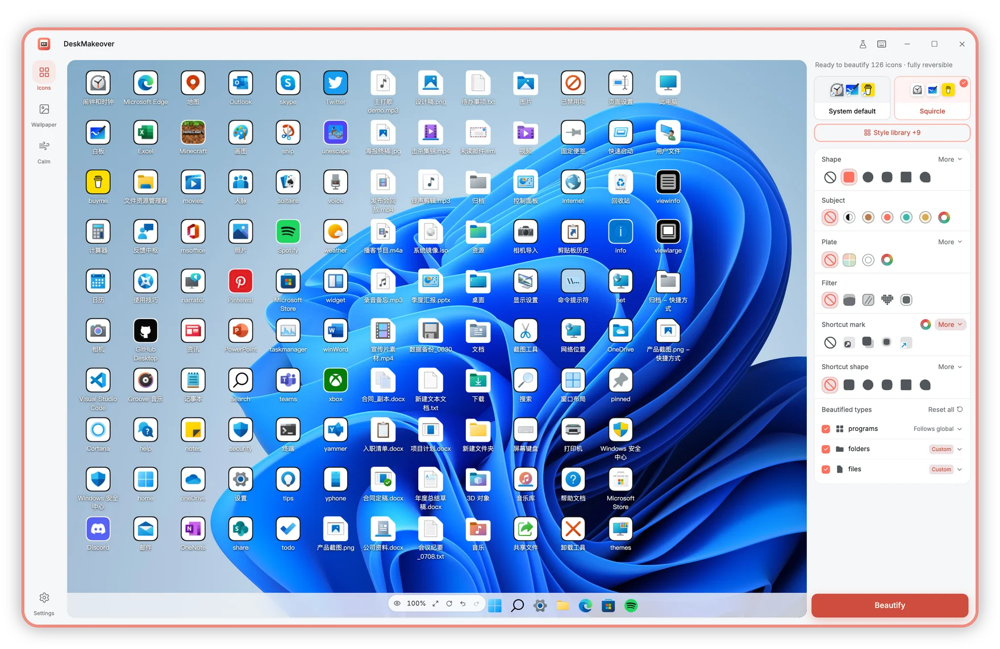
<br/>
<sub>Every tab works the same way: adjust on the right, watch your real desktop change live on the left.</sub>
</div>

## 📦 How to install

The first installer is being prepared and will land on the [Releases](https://github.com/nicepkg/deskmakeover/releases) page. Then it's: download, double-click, done. It installs just for your account.

> If Windows shows a blue "Windows protected your PC" screen, don't worry. It's not a virus warning, just Windows being cautious with newer software. Click **More info**, then **Run anyway**.

Runs on Windows 10 (1809 or newer) and Windows 11, 64-bit.

## 💬 Questions people ask

**Can it break my PC, or leave me stuck?**
It backs up your desktop before changing anything, and every change is one click to undo, back to exactly how it was. Experiment freely.

**Will it slow my PC down?**
Not noticeably. The heavy work happens once when you hit apply; the rest of the time it sits quietly, and puts your look back if Windows resets the desktop.

**Will it survive a restart?**
Yes. Restyled icons are real image files. If a big Windows update resets some settings, re-apply with one click, or restore.

**Is it free? Does anything get uploaded?**
Completely free and open source. Runs only on your computer, no account, nothing sent anywhere.

**I'm not great with computers. Can I use it?**
Yes. Pick a look, check the preview, click apply. No commands, no technical settings, and restore is always one click away.

> **Straight talk:** this is beta, the first installer is on the way, and there will be rough edges. It styles your icons and wallpaper zones; it isn't a full theme for all of Windows. Don't expect one-click perfection, but whatever you try, one click takes it back.

<div align="center"><br/><br/><br/></div>

## 🏗️ Architecture and tech choices

DeskMakeover is a **Tauri 2 + Rust** desktop app with a **React 19 + TypeScript** UI rendered in the system WebView (WebView2). The pixels are owned by one Rust icon core:

```
React UI ──(tauri-specta bridge)──▶ Rust host
  │                                   │
  │  live preview + design controls   ├─ dm-icon-core   one pixel truth
  │  WYSIWYG canvas (Pixi wallpaper)  │                 (WASM + native)
  └─ mock backend for browser dev     ├─ dm-windows     shell · registry · geometry
                                      ├─ dm-operations  snapshot · apply · restore
                                      ├─ dm-resident    tray + reconciler
                                      └─ dm-elevated    tiny whitelisted helper
```

**Why these choices:**

- **Tauri 2 over Electron**: the UI runs in the system's own WebView2, no bundled Chromium, so the installer and memory footprint stay an order of magnitude smaller.
- **One Rust icon core**: `dm-icon-core` renders the live preview (compiled to WASM) and bakes the final icons (native) from the same code. Preview pixels are the applied pixels by construction, not by luck.
- **Generated contracts**: the TS↔Rust bridge is generated from `dm-contracts` and locked by a bindings test in CI, so the two sides can't drift.
- **Web-first dev loop**: the UI develops against a mock backend in a browser (`bun run dev`, 600+ tests on bun), no Windows box needed; the Windows side only does shell writes, snapshot/restore, tray reconciling, and elevation.
- **Reversibility as an architectural constraint**: every write goes through `dm-operations`' snapshot + transaction ledger. Hiding the native shortcut arrow is the elevated helper swapping one Shell Icons registry value, snapshotted first and restored exactly like everything else.

The full picture lives in [`docs/development.md`](docs/development.md) and the design specs under [`docs/specs/`](docs/specs).

## 🛠️ For developers

[](https://github.com/nicepkg/deskmakeover/actions/workflows/ci.yml)

You need [**Bun**](https://bun.sh) ≥ 1.1 and the Rust toolchain pinned in [`rust-toolchain.toml`](rust-toolchain.toml) (installed automatically by `rustup`). Bun is the only JS toolchain here.

```bash
bun install
bun run dev          # web UI against a mock backend — any OS, browser + hot reload
bun run tauri:dev    # full desktop app (Windows) — compiles the Rust host, opens the window
```

The full dev runbook (dev modes, tests, packaging, signing) lives in [`docs/development.md`](docs/development.md); local builds are always unsigned and work anywhere.

## 🤝 Contributing

The React UI, the Rust core, docs, localization, and Windows compatibility testing all welcome help; most of the UI develops in a browser. Start with [`CONTRIBUTING.md`](CONTRIBUTING.md) and the [good first issues](https://github.com/nicepkg/deskmakeover/issues?q=is%3Aissue+is%3Aopen+label%3A%22good+first+issue%22). Security reports go through [`SECURITY.md`](SECURITY.md).

## 📄 License

[MIT](LICENSE) © 2026 [Jinming Yang](https://github.com/2214962083). Free and open source.

<div align="center">

**Made your desktop nicer? [Give it a ⭐](https://github.com/nicepkg/deskmakeover) so more people find it.**


<br/><b>DeskMakeover · 桌面美颜</b><br/><sub>[Releases](https://github.com/nicepkg/deskmakeover/releases) · [Issues](https://github.com/nicepkg/deskmakeover/issues) · English · [中文](README.zh-CN.md)</sub>

</div>
