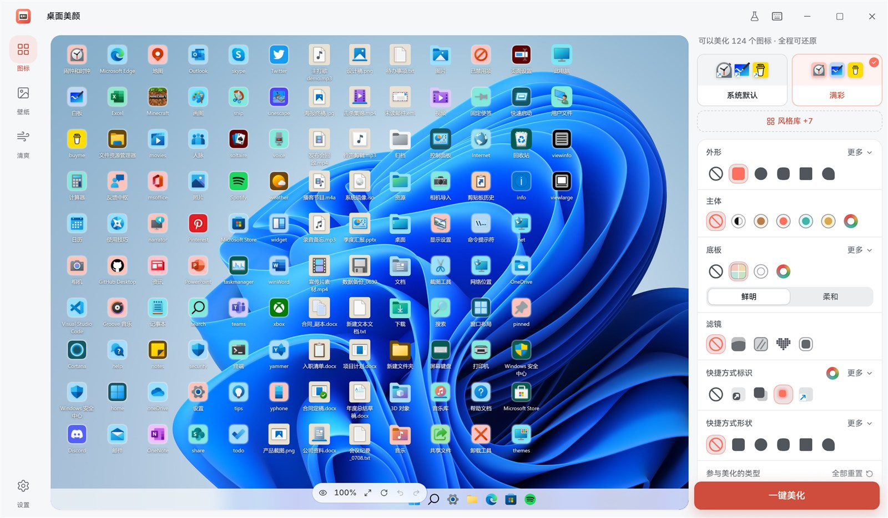

<div align="center">


# DeskMakeover · 桌面美颜

**一键美颜你的 Windows 桌面,随时完整还原。**

[](LICENSE)
[](#安装)
[](https://v2.tauri.app/)
[](https://github.com/nicepkg/deskmakeover/actions/workflows/ci.yml)
[](https://github.com/nicepkg/deskmakeover/releases)

[English](README.md) · **中文**



</div>

---

DeskMakeover(**桌面美颜**)把杂乱的 Windows 桌面变干净、变好看,而且**完全可还原**。
它重绘你的桌面图标,在图标背后铺半透明的壁纸分区——所有改动都先实时预览再落地,并且随时一键
还原到分毫不差的原样。不用 PowerShell、不用改注册表、不用手动换图标。它是给"想要更好看的桌面"
的人用的,不是给你上一堂教程。

> **状态 — Beta。** DeskMakeover 正朝首个正式 tag 版本积极开发中。桌面壳已在真实 Windows 10/11
> 上运行,安装包做了 Authenticode 签名,只读面(扫描 / 几何 / 提取)已真机验证。应用 / 还原路径
> 在 Windows 写入面完成验证前,采用作者监督执行。请预期仍有毛边,并锁定你信任的版本。

## 为什么做它

Windows 只给了你一张壁纸和一堆参差不齐的图标,却没有一条安全的路把它变得"像被设计过"。网上流传
的"桌面清爽"技巧都是单向的:藏图标、改注册表、手动替换 `.ico`,想撤销全凭运气。DeskMakeover 把
**可还原当成产品本身**:改之前先快照、落地前先预览,并始终保留一条可见、可靠的路,回到你桌面
原本的样子。

## 功能

- **一键美颜** — 在你*真实*桌面的实时镜像上(真壁纸、真图标位置)重绘每一个图标。按住对比原样、
  轻点偷看前后、右键单独覆盖任意图标,支持完整撤销 / 重做与版本历史。
- **一套真正的图标设计系统** — 基于地道 iOS 连续圆角 *squircle* 几何的 11 形状目录(苹果 · 圆形 ·
  三星 · 方块 · 水滴 · 书签 · 柠檬 · 菱形 · 花朵 · 鹅卵石 · 无)、配色处理(原彩 / 黑白 / 极致单色)
  与共享调色盘、精修的快捷方式标记、质感滤镜。图标主体像素永不被重新上色——外观靠底板、剪影、背景
  来区分。
- **壁纸分区** — 直接在壁纸上画半透明面板来给图标分组:五种材质、四种标题样式、可选烘焙阴影、可调
  圆角、网格吸附。原壁纸自动备份,一键还原。
- **清爽(Calm Windows)** — 一个引导式、fail-closed 的助手,帮你安静掉吵闹的系统默认项。任何一条
  调整在其配方被认证前都不会真正写入;在那之前它*教你*真正的 Windows 设置在哪,并直接带你过去。
- **所见即所得(WYSIWYG)** — 预览的像素就是落地的像素。同一套渲染代码既画屏上预览,又以原生分辨率
  烘焙最终图标,你看到的就是你得到的。
- **还原永远在手边** — 任何改动前都先快照;还原只需一键,带回你原本的图标、箭头和壁纸。

## 安装

1. 从 [**Releases**](https://github.com/nicepkg/deskmakeover/releases) 页面下载最新的签名安装包
   (`DeskMakeover_x.y.z_x64-setup.exe`)。
2. 运行它。它按用户安装(不弹管理员提示),若系统没有 WebView2 运行时会自动拉取。
3. 打开 **DeskMakeover** 开始美颜——一切都先预览、可还原。

> 需要 Windows 10(1809+)或 Windows 11,x64。安装包与 app `.exe` 都做了 Authenticode 签名;主界面
> 无需管理员权限运行,少数特权操作走一个小的、白名单化的提权助手。

## 从源码构建

需要 [**Bun**](https://bun.sh) ≥ 1.1 与 [`rust-toolchain.toml`](rust-toolchain.toml) 里锁定的 Rust
工具链(1.97.0 + `wasm32-unknown-unknown` target,`rustup` 会自动装)。Bun 是唯一的 JS 工具链——
绝不用 `npm`/`node`。

```bash
# 1. 克隆 + 装 JS 依赖
git clone https://github.com/nicepkg/deskmakeover.git
cd deskmakeover
bun install

# 2. 用 mock 后端跑 web UI —— 任意 OS,浏览器 + 热更新
bun run dev
bun test            # 600+ web 测试

# 3. 跑完整桌面 app(Tauri 2 + Rust host)—— Windows
bun run tauri:dev   # 编译 Rust workspace,启动 Vite,打开窗口

# 4. 产出安装包(未签名 NSIS,位于 target/release/bundle/nsis/)
bun run tauri:build
```

签名是一层 CI-only overlay(见 [`docs/signing-setup.md`](docs/signing-setup.md));本地
`tauri:build` 永远未签名、在哪都能跑。完整开发手册(开发模式、Tauri 循环、打包)见
[`docs/development.md`](docs/development.md)。

## 工作原理

DeskMakeover 是一个 **Tauri 2 + Rust** 桌面 app,UI 是渲染在系统 WebView(Windows 上是 WebView2)
里的 **React**。像素由一个 Rust 图标内核统一拥有:

```
React UI  ──(生成式 bridge,tauri-specta)──▶  Rust host
  │                                              │
  │  实时预览 + 设计控件                          ├─ dm-icon-core   唯一像素真理(WASM 预览 + 原生烘焙)
  │  WYSIWYG 画布(Pixi 壁纸)                     ├─ dm-windows     shell / 注册表 / 桌面几何
  └─ 浏览器开发用 mock 后端                        ├─ dm-operations  快照 · 应用 · 还原
                                                  ├─ dm-resident    后台托盘 + reconciler
                                                  └─ dm-elevated    极小的白名单提权助手
```

bridge 契约由 `dm-contracts` crate **生成**,所以 TypeScript 与 Rust 两侧永不漂移。web 半边可独立
对着 mock 后端运行,这也是大部分 UI 在浏览器循环里构建和测试的原因。详见
[`docs/development.md`](docs/development.md) 与 [`docs/specs/`](docs/specs) 下的设计规格。

## 隐私与安全

- **纯本地。** 无账号、无上传、无遥测、无云依赖——一切都在你机器上运行、留存。
- **改前快照、落地前预览、还原始终可见。** 这些是硬规则,不是选项。
- **主 app 不需要管理员。** 特权操作被隔离在一个带固定动作白名单的小助手里。

## 参与贡献

欢迎提 issue 和 PR。先看 [`CONTRIBUTING.md`](CONTRIBUTING.md):环境搭建、家规(极致 DRY、文件
≤ 500 行、只用暖珊瑚色强调、用户文案不用破折号、每个 bug 修复都带回归测试)、以及 commit / PR 规范。
安全问题走 [`SECURITY.md`](SECURITY.md)。

## 许可证

[MIT](LICENSE) © 2026 [Jinming Yang](https://github.com/2214962083)。免费开源。
