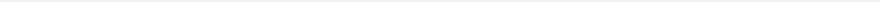

<div align="center">


# DeskMakeover

**桌面美颜：给你的 Windows 桌面换个好看的样子。不喜欢，一键变回原样。**

[](https://dm.xiaominglab.com/zh/)
[](#-怎么安装)
[](#-怎么安装)
[](LICENSE)
[](https://v2.tauri.app/)

[English](README.md) · **中文**

<br/>

<a href="#-怎么安装">
  
</a>

DeskMakeover（桌面美颜）把乱糟糟的 Windows 桌面收拾成看着顺眼的样子。<br/>先预览，满意才落地；不满意，一键回到原样。

</div>

## ↩️ 随时能变回来

想动桌面又怕弄坏了回不去？「回不去」是我们最先解决的事：

- **动手前先完整备份**，像先给桌面拍张照片：图标、箭头、壁纸，原封不动留好
- **一键还原**，和你没动过时一模一样
- **只在你电脑上跑**：不注册、不联网、不上传
- **不用碰任何技术设置**：挑、预览、点一下，就这三件事

<div align="center"><br/><br/><br/></div>

## ✨ 九套现成外观，一键上身

每一套都在真实桌面上手工调过。挑一套点一下，所有图标就换上。同一个文件夹，九种穿法：

<div align="center">

<br/>
<sub>方圆 · 蓝图 · 像素纪元 · 浮光 · 釉光 · 随形贴 · 圆窗 · 拼贴手帐 · 溪石</sub>
</div>

<br/>

<table align="center">
<tr>
  <td align="center"><br/><b>方圆</b><br/><sub>圆角连续，顺滑过渡</sub></td>
  <td align="center"><br/><b>蓝图</b><br/><sub>一整套工程蓝图</sub></td>
  <td align="center"><br/><b>像素纪元</b><br/><sub>回到八比特的下午</sub></td>
</tr>
<tr>
  <td align="center"><br/><b>浮光</b><br/><sub>原样的图标，掠过一层光</sub></td>
  <td align="center"><br/><b>釉光</b><br/><sub>上过釉的冷瓷面</sub></td>
  <td align="center"><br/><b>随形贴</b><br/><sub>沿轮廓裁开的贴纸</sub></td>
</tr>
<tr>
  <td align="center"><br/><b>圆窗</b><br/><sub>干净利落的圆形</sub></td>
  <td align="center"><br/><b>拼贴手帐</b><br/><sub>随手拼贴的一页</sub></td>
  <td align="center"><br/><b>溪石</b><br/><sub>溪水磨圆的石头</sub></td>
</tr>
</table>

## 🎨 每一处都能自己调

九套只是起点。十一种图标形状，配色、底板、质感、快捷方式标记都能单独换，组合上千种：

- 程序、文件夹、普通文件，可以各用各的样子
- 按住对比原样，右键单独改一个图标，随时撤销重做

<div align="center">

<br/>
<sub>左边是放大的实时预览，右边每一个轴都能单独调。</sub>
</div>

## 🧩 存成自己的风格，还能分享

调顺眼了就存成自己的风格，下次一键复用。导出成文件发给朋友，导入别人的风格包直接用。

<div align="center">

<br/>
<sub>你的风格和内置外观放在一起：保存、导出、导入。</sub>
</div>

## 🗂️ 在壁纸上圈出分区，图标不再乱堆

图标堆成一片找不着？在壁纸上圈几块半透明分区，工作一块、娱乐一块。位置大小随便拖，五种材质、四种标题样式，还有现成的布局模板一键铺好。原壁纸自动备份，一键撤掉。

<div align="center">

<br/>
<sub>一个布局模板点下去，这三块分区就铺好了。</sub>
</div>

## ✂️ 快捷方式的小箭头，可换可去

嫌那个小箭头丑？换成精致的小标记，或者干脆去掉。应用替你完成，Windows 会弹一次确认框，点「允许」就行。改之前照样备份，一键装回。

> 内置的「清爽」小助手还能安静掉 Windows 一些吵闹的默认设置。改哪条都先问你，也都能改回来。

<div align="center"><br/><br/><br/></div>

## 🎛️ 走进工作台

<div align="center">

<br/>
<sub>每个标签页都是这个用法：右边调整，左边的真实桌面实时跟着变。</sub>
</div>

## 📦 怎么安装

首个安装包正在准备，做好会放到 [Releases](https://github.com/nicepkg/deskmakeover/releases) 页面。到时候：下载、双击、开用，只装给你自己的账户。

想先看看完整介绍？官网在 **[dm.xiaominglab.com](https://dm.xiaominglab.com/zh/)**。

> 看到蓝色的「Windows 已保护你的电脑」别慌：不是病毒警告，只是 Windows 对下载人数还不多的新软件比较谨慎。点「更多信息」，再点「仍要运行」即可。

支持 Windows 10（1809 及以上）和 Windows 11，64 位。

## 💬 常见问题

**会不会把电脑弄坏，回不去？**
动手前先完整备份，任何改动一键还原到没动过的样子。这是最优先保证的事，随便试。

**会不会拖慢电脑？**
不会让你察觉。重活只在点「应用」那一下干一次，平时安安静静待着；Windows 把桌面刷回默认时它会帮你补回来。

**重启之后还在吗？**
在。换好的图标是真实图片文件，重启不丢。Windows 大更新重置了设置的话，一键重新应用或还原。

**要花钱吗？会上传我的东西吗？**
完全免费，开源。只在你电脑上跑，不注册账号，什么都不上传。

**我不太懂电脑，能用明白吗？**
能。挑一套、看预览、点一下，全程没有命令和技术设置。挑错了随时一键还原。

> **说句实在话：** 现在还是 Beta，首个安装包在准备中，会有毛边。它只负责桌面图标和壁纸分区，不给整个 Windows 换主题。别指望一键完美，但怎么调都能一键收回，放心试。

<div align="center"><br/><br/><br/></div>

## 🧬 一套像素核心，每次算出同样的结果

每一套外观都由 [`dm-icon-core`](crates/dm-icon-core) 渲染。这是一条约 12,000 行的纯 Rust 像素管线，零 I/O、零平台依赖。它先读懂每颗图标再动手：分类、背景检测、主体与背景分离、主色提取，然后在硬规则下重新造型。没有机器学习，没有云端，没有数据上报：同样的输入永远得到同样的像素，完全离线。

- **预览即结果，可证明。** 核心同时编译为 WASM（实时预览）与原生（最终落盘）。一份确定性契约（超越函数只走 [`libm`](crates/dm-icon-core/src/color.rs)、禁 FMA/SIMD、禁顺序相关归约）让两个构建的输出逐字节一致，并在 1,487 颗真实图标语料上持续认证（[`tests/parity_determinism.rs`](crates/dm-icon-core/tests/parity_determinism.rs)）。
- **感知优先的色彩。** 全部颜色数学运行在 OKLab 与 linear-light sRGB 上。防止主体融进底盘的自动分离救援用「色距 + 亮度差」双门限判定（[`separation.rs`](crates/dm-icon-core/src/separation.rs)），依据是在 32 px 图标的空间频率下，人眼对亮度的分辨远好于色度。
- **品牌色永远是品牌色。** [`compose/field.rs`](crates/dm-icon-core/src/compose/field.rs) 里的一条铁律：主体像素永不重上色。图标之间靠底盘、描边和阴影区分；相撞的底盘色相被确定性地旋转分开（[`hue_spread.rs`](crates/dm-icon-core/src/hue_spread.rs)）。
- **标准方法，用心组装。** Otsu 主体底盘分割、IoU 轮廓匹配、linear-light 预乘 alpha 面积平均重采样，以及对 Figma MIT 圆角平滑数学的忠实移植（[`shapes/smooth.rs`](crates/dm-icon-core/src/shapes/smooth.rs)）：是组合，不是重新发明。
- **出错即收敛。** 核心全程 [`#![forbid(unsafe_code)]`](crates/dm-icon-core/src/lib.rs)；唯一的 unsafe 是极薄的 WASM FFI 边界，每次分配都做溢出检查（[`dm-icon-wasm`](crates/dm-icon-wasm/src/lib.rs)）。退化输入返回错误码而不是 panic；应用层动手之前先给桌面拍快照。

想看这条管线逐步运行，并在浏览器里亲手驱动同一个 WASM 构建，请访问 **[dm.xiaominglab.com/zh/engine](https://dm.xiaominglab.com/zh/engine/)**。

## 🏗️ 架构与技术选型

DeskMakeover 是 **Tauri 2 + Rust** 桌面应用，UI 是渲染在系统 WebView（WebView2）里的 **React 19 + TypeScript**，像素由一个 Rust 图标内核统一拥有：

```
React UI ──(tauri-specta 生成式 bridge)──▶ Rust host
  │                                   │
  │  实时预览 + 设计控件              ├─ dm-icon-core   唯一像素真理
  │  WYSIWYG 画布(Pixi 壁纸)          │                 (WASM 预览 + 原生烘焙)
  └─ 浏览器开发用 mock 后端           ├─ dm-windows     shell · 注册表 · 桌面几何
                                      ├─ dm-operations  快照 · 应用 · 还原
                                      ├─ dm-resident    后台托盘 + reconciler
                                      └─ dm-elevated    白名单提权小助手
```

**为什么这么选：**

- **Tauri 2 而不是 Electron**：UI 跑在系统自带的 WebView2 里，不捆 Chromium，安装包和内存占用小一个量级。
- **一个 Rust 图标内核**：`dm-icon-core` 同一套渲染代码，预览时编译成 WASM 在浏览器跑，落地时原生跑。预览像素就是最终像素，所见即所得是构造出来的，不是碰运气。
- **契约生成，两侧不漂移**：TS 和 Rust 之间的 bridge 由 `dm-contracts` 生成，CI 里有 bindings 测试锁住。
- **web 优先的开发循环**：UI 对着 mock 后端在浏览器里开发（`bun run dev`，600+ 测试跑在 bun 里），不需要 Windows 机器；Windows 侧只做 shell 写入、快照还原、托盘校对和提权。
- **可还原是架构约束**：所有写入走 `dm-operations` 的快照加事务账本；隐藏原生箭头是提权助手改一个 Shell Icons 注册表值，同样先快照、可精确还原。

全貌见 [`docs/development.md`](docs/development.md) 与 [`docs/specs/`](docs/specs) 下的设计规格。

## 🛠️ 面向开发者

[](https://github.com/nicepkg/deskmakeover/actions/workflows/ci.yml)

需要 [**Bun**](https://bun.sh) ≥ 1.1 与 [`rust-toolchain.toml`](rust-toolchain.toml) 锁定的 Rust 工具链（`rustup` 自动装）。本仓库只用 Bun 这一个 JS 工具链。

```bash
bun install
bun run dev          # 用 mock 后端跑 web UI：任意 OS，浏览器 + 热更新
bun run tauri:dev    # 完整桌面应用(Windows)：编译 Rust host，打开窗口
```

完整开发手册（开发模式、测试、打包、签名）见 [`docs/development.md`](docs/development.md)；本地构建永远未签名，在哪都能跑。

## 🤝 参与贡献

React UI、Rust 内核、文档、本地化、Windows 兼容性测试都欢迎；大部分 UI 在浏览器里就能开发测试。先看 [`CONTRIBUTING.md`](CONTRIBUTING.md)，再看 [good first issue](https://github.com/nicepkg/deskmakeover/issues?q=is%3Aissue+is%3Aopen+label%3A%22good+first+issue%22)。安全问题走 [`SECURITY.md`](SECURITY.md)。

## 📄 许可证

[MIT](LICENSE) © 2026 [Jinming Yang](https://github.com/2214962083)。免费开源。

<div align="center">

**桌面变好看了？[给个 ⭐](https://github.com/nicepkg/deskmakeover) 让更多人看到它。**


<br/><b>DeskMakeover · 桌面美颜</b><br/><sub>[官网](https://dm.xiaominglab.com/zh/) · [Releases](https://github.com/nicepkg/deskmakeover/releases) · [Issues](https://github.com/nicepkg/deskmakeover/issues) · [English](README.md) · 中文</sub>

</div>
